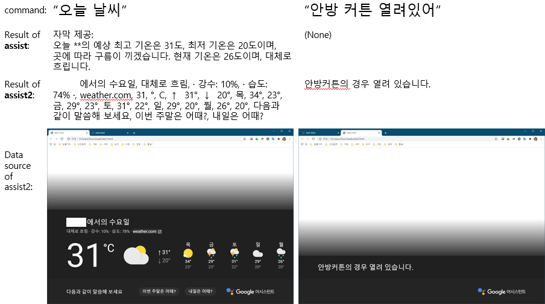

# google_assistant_relay
Home Assistant custom component that sends text input to Google Assistant.

## Usage
```
service: google_assistant_relay.assist
data:
  query: "Turn on the light of livingroom" // light of livingroom from Google Home
```

## Prequisite
- Need specific device_model_id.
  - Follow instructions from the [link](https://developers.google.com/assistant/sdk/guides/service/python/embed/register-device) to generate device_model_id.
- Need 'credentials.json' file.
  - Follow instructions from the [link](https://developers.google.com/assistant/sdk/guides/service/python/embed/install-sample) to obtain credentials.json.

## Installation
#### HACS:
1. add custom repositories at HACS: https://github.com/n-andflash/HASS-google-assistant-relay/ and press install
2. Place 'credentials.json' in `<config directory>` (eg. `<config directory>/credentials.json` )

#### manual:
1. Download
    ```
    /custom_components/google_assistant_relay/
    ```
    into
    ```
    <config directory>/custom_components/google_assistant_relay/
    ```
2. Place 'credentials.json' in `<config directory>` (eg. `<config directory>/credentials.json` )

## Configuration
#### Example configuration.yaml:
```yaml
google_assistant_relay:
  credentials: credentials.json
  language: ko-KR
  device_model_id: your-device-model-id--do-not-use-this-example-id
```
#### Configuration variables:

| key | required | default | dataType | description
| --- | --- | --- | --- | ---
| **credentials** | yes | 'credentials.json' | string | relative path of credentials.json file from `<config directory>`
| **language** | no | 'en-US' | string | language of a query
| **device_model_id** | no | 'test_device_model_id' | string | You should specify your device model id. If not, 'assist2' service is not working.

## Services
### google_assistant_relay.assist

* Format of response from Google is a text. It is a better readability if provided, but not always given.

| service data attribute | required | dataType | description
| --- | --- | --- | ---
| **query** | yes | string | text input to Google Assistant
| **response_event** | no | string | an event that contains response text from Google Assistant

### google_assistant_relay.assist2

* Format of response from Google is HTML. That is complex, but Google always response something at least.

| service data attribute | required | dataType | description
| --- | --- | --- | ---
| **query** | yes | string | text input to Google Assistant
| **response_event** | no | string | an event that contains response text from Google Assistant

### example result



## Credit
- https://github.com/googlesamples/assistant-sdk-python/tree/master/google-assistant-sdk/googlesamples/assistant/grpc
